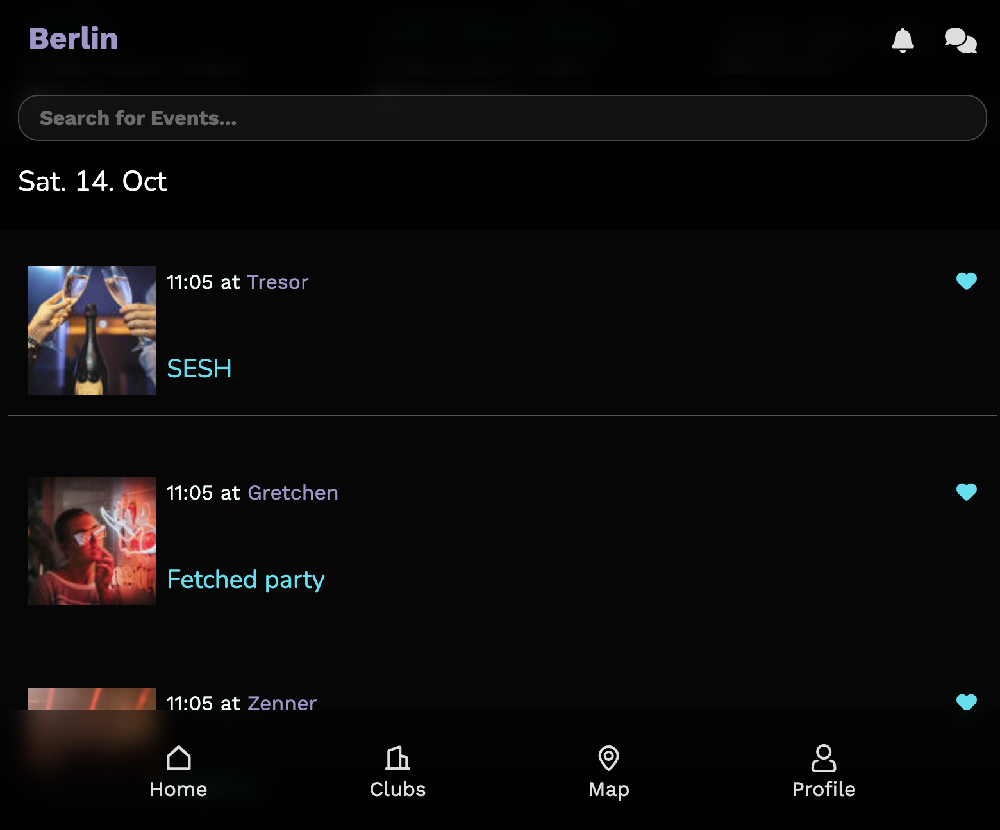
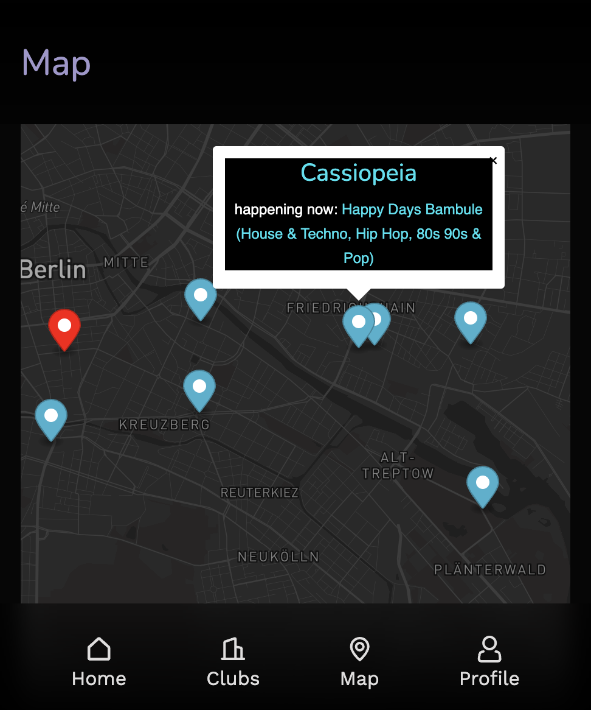
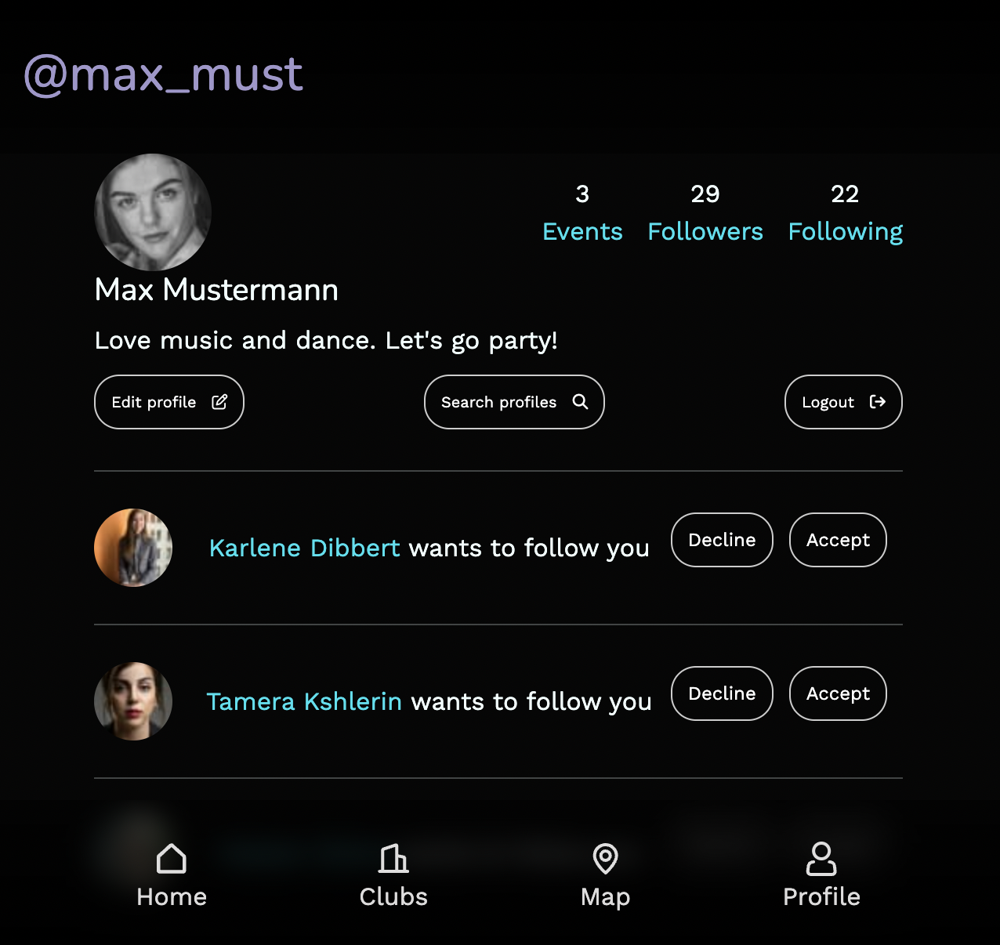

# Party Time - Rails App

Welcome to Party Time, a Ruby on Rails application that makes it easy for users to discover and enjoy parties and events in Berlin.

## Features

### 1. Event Search
- Users can search for events happening in Berlin.

### 2. Event Details
- Users can view details about events, including venues, artists, and other event-related information.

### 3. Interactive Map
- Party Time includes an interactive map that shows the user's location and pins for all the events happening around them.

### 4. User Connections
- Users can follow and be followed by other users, fostering a sense of community within the app.

### 5. Party Interest
- Users can express their interest in attending a party by marking it as "interested."

### 6. Chat Functionality
- Party Time enables users to engage in chat conversations with other users, facilitating communication and event planning.

### 7. Party Crowd Level
- Users can check how busy a party is, helping them make informed decisions about attending.

### 8. Live Event Updates
- A live chat feature is available on the events page, allowing users to stay up-to-date with the latest party information and interact with fellow attendees.

